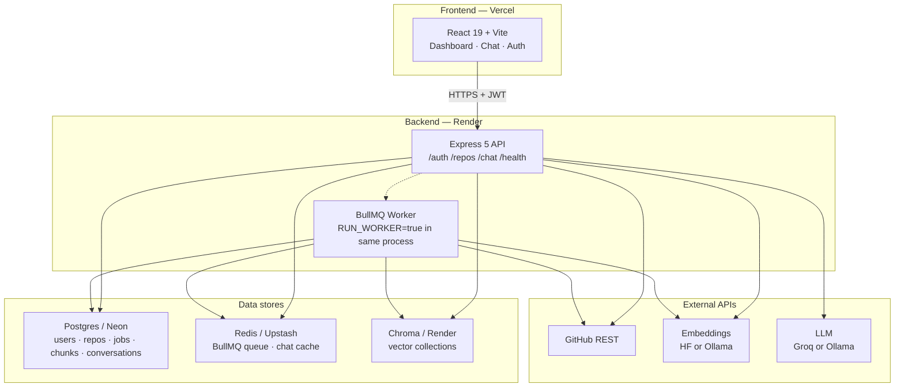

# AI Codebase Explainer — Complete In-Depth Guide

> Everything about how this project works: architecture, every pipeline stage, why each technology was chosen, diagrams, env/deploy, and interview Q&A with answers grounded in *this* codebase.

---

## Table of contents

1. [What this product is](#1-what-this-product-is)
2. [High-level architecture](#2-high-level-architecture)
3. [Tech stack (and why each piece)](#3-tech-stack-and-why-each-piece)
4. [Repository layout](#4-repository-layout)
5. [User journeys](#5-user-journeys)
6. [End-to-end flow (Index → Chat)](#6-end-to-end-flow-index--chat)
7. [Ingestion pipeline (deep dive)](#7-ingestion-pipeline-deep-dive)
8. [Chat / RAG pipeline (deep dive)](#8-chat--rag-pipeline-deep-dive)
9. [Why tree-sitter?](#9-why-tree-sitter)
10. [Why hybrid search (not dense-only)?](#10-why-hybrid-search-not-dense-only)
11. [UML / flow diagrams in the app (Mermaid)](#11-uml--flow-diagrams-in-the-app-mermaid)
12. [Intent modes](#12-intent-modes)
13. [Auth, tenancy, and security](#13-auth-tenancy-and-security)
14. [Database schema](#14-database-schema)
15. [API reference](#15-api-reference)
16. [Frontend architecture](#16-frontend-architecture)
17. [Local development](#17-local-development)
18. [Production (free tier)](#18-production-free-tier)
19. [Environment variables](#19-environment-variables)
20. [Constants cheat sheet](#20-constants-cheat-sheet)
21. [Known limitations & gaps](#21-known-limitations--gaps)
22. [Interview Q&A (project-specific)](#22-interview-q--a-project-specific)

---

## 1. What this product is

**AI Codebase Explainer** is a RAG (Retrieval-Augmented Generation) app that:

1. Lets a user paste a **public GitHub repository URL**
2. **Indexes** that code (fetch → parse → chunk → embed → store)
3. Lets the user **ask questions** about the repo
4. Answers using **retrieved code context**, with **file:line citations**
5. Can also emit **UML / sequence diagrams** (Mermaid) for Architecture and Flow modes

It is **not** a general chatbot. It is a **code-grounded** assistant: the model should only talk about what was indexed.

---

## 2. High-level architecture



### Mental model

| Layer | Job |
|-------|-----|
| **UI** | Collect URL/questions, poll job status, stream answers |
| **API** | Auth, validate, enqueue, orchestrate RAG |
| **Worker** | Heavy ingest (minutes, not milliseconds) |
| **Postgres** | Source of truth for text chunks + jobs + history |
| **Chroma** | Fast similarity search over embeddings |
| **Redis** | Job queue + short answer cache |
| **GitHub / HF / Groq** | Fetch code, embed, generate |

**Postgres is source of truth for chunk text.** Chroma is a rebuildable index. If Chroma disk is wiped on free Render, the app can re-embed from Postgres (`chroma.rehydrate.ts`).

---

## 3. Tech stack (and why each piece)

### Frontend

| Tech | Why |
|------|-----|
| **React 19 + Vite** | Fast SPA for dashboard + streaming chat |
| **TypeScript** | Safer contracts with the API |
| **Zustand** | Lightweight auth/UI state (JWT persist) |
| **Axios** | REST + auto-refresh on 401 |
| **Tailwind** | Utility styling |
| **react-syntax-highlighter** | Code blocks in answers |
| **Mermaid** | Render UML/sequence diagrams the LLM emits as text |

### Backend

| Tech | Why |
|------|-----|
| **Express 5** | Simple HTTP API |
| **BullMQ + Redis** | Async ingestion without blocking HTTP |
| **Postgres** | Relational data + full-text search (BM25-ish via `ts_rank`) |
| **Chroma** | Dedicated vector ANN store |
| **tree-sitter** | Structural parse of JS/TS into functions/classes |
| **Zod** | Request validation |
| **JWT + bcryptjs** | Stateless auth |
| **Helmet + CORS** | Baseline HTTP hardening |
| **Pino** | Structured logs (what you see on Render) |
| **tiktoken** | Approximate token budgets for context packing |

### AI providers

| Mode | Embeddings | LLM |
|------|------------|-----|
| **Local** | Ollama `nomic-embed-text` | Ollama `llama3.2` |
| **Production** | Hugging Face `sentence-transformers/all-mpnet-base-v2` (768-d) | Groq `openai/gpt-oss-20b` |

**Why not Ollama in production?** Free Render has no GPU and can’t host large local models reliably. Groq gives cheap/fast chat; HF Inference gives cloud embeddings. Nomic often returns **400** on HF serverless, so production defaults to **mpnet**.

---

## 4. Repository layout

```
ai_codebase_explainer/
├── README.md                 # Quick start
├── DEPLOY.md                 # Free-tier deploy checklist
├── PROJECT_GUIDE.md          # This document
├── render.yaml               # Render blueprint (API + Chroma)
├── frontend/
│   └── src/
│       ├── pages/            # Login, Register, Dashboard, Chat
│       ├── components/       # ChatWindow, Mermaid, RepoInput, Health
│       ├── api/              # Axios + SSE
│       ├── hooks/            # useIngestRepo, useStreamQuery, useAuth
│       ├── store/            # Zustand
│       └── constants/        # Intent chips + example prompts
└── backend/
    ├── docker-compose.yml    # Postgres, Redis, Chroma, Ollama
    └── src/
        ├── modules/          # auth, repo, chat, health
        ├── workers/          # ingestion.worker
        ├── queues/           # BullMQ
        ├── services/         # github, parser, chunker, embedder,
        │                     # chroma, retriever, llm, context, cache
        ├── db/migrations/    # SQL schema
        └── config/           # env, db, redis, chroma
```

---

## 5. User journeys

### A. Register / login

1. `AuthBootstrap` restores session (refresh token → new access token → `/auth/me` if needed).
2. Login/register return **tokens + user** in one response (avoids an extra round-trip).
3. JWT access (~15m) + refresh (~7d). bcrypt cost **8** (faster on free-tier CPU).

### B. Index a repo

1. Paste `https://github.com/owner/repo` (+ branch, default `main`).
2. Client validates GitHub-only URL.
3. `POST /repos` with Bearer JWT.
4. Server validates **public** repo + branch via GitHub API.
5. Creates `repos` + `ingestion_jobs` rows, enqueues BullMQ job.
6. UI polls `GET /repos/status/:jobId` every **3 seconds**.
7. When `completed` → navigate to `/app/chat/:repoId`.

If the same user already has that URL+branch as `ready`, API returns **200** with `isExisting: true` (no re-index).

### C. Chat

1. Pick intent chip (Lookup / Architecture / Flow / Debug) or let the server classify.
2. `POST /chat/query/stream` → SSE tokens → citations event.
3. `AnswerRenderer` shows prose, steps, code blocks, and **Mermaid** diagrams.
4. Citation badges open the code viewer for verified `[file:line]` refs.

---

## 6. End-to-end flow (Index → Chat)

```mermaid
sequenceDiagram
  actor User
  participant UI as React UI
  participant API as Express API
  participant GH as GitHub
  participant Redis as Redis
  participant Worker as BullMQ Worker
  participant Embed as HF/Ollama
  participant Chroma as Chroma
  participant PG as Postgres
  participant LLM as Groq/Ollama

  User->>UI: Paste URL + Index
  UI->>API: POST /repos (JWT)
  API->>GH: Validate public repo + branch
  API->>PG: INSERT repos, ingestion_jobs
  API->>Redis: Enqueue job
  API-->>UI: 202 {repoId, jobId}

  loop Every 3s
    UI->>API: GET /repos/status/:jobId
    API->>PG: Read progress
    API-->>UI: progress %
  end

  Worker->>Redis: Claim job
  Worker->>GH: Fetch tree + blobs
  Worker->>Worker: Filter → parse → chunk
  Worker->>Embed: Embed chunks
  Worker->>Chroma: Upsert vectors
  Worker->>PG: INSERT chunks; status=ready
  UI-->>User: Open chat

  User->>UI: Ask question
  UI->>API: POST /chat/query/stream
  API->>API: Prompt-injection sanitize
  API->>Embed: Embed query
  API->>Chroma: Vector search
  API->>PG: BM25 + ILIKE
  API->>API: RRF fuse → build context
  API->>LLM: Stream answer
  LLM-->>UI: SSE tokens
  API->>PG: Save conversation
  UI-->>User: Answer + citations (+ Mermaid)
```

**Important:** the UI never talks to BullMQ. It only reads **Postgres job rows**. The worker updates those rows as it progresses.

---

## 7. Ingestion pipeline (deep dive)

**Entry:** `createRepo` → `addIngestionJob` → `processIngestion` in `ingestion.worker.ts`.

### Progress percentages (as coded)

| % | Stage |
|---|--------|
| 5 | Job starts; status `processing` |
| 20 | Files fetched from GitHub |
| 35 | Stale chunks cleared; ready to parse |
| 50 | `parseFile` done |
| 60 | `buildChunks` done |
| 80 | `embedTexts` done |
| 88 | Vectors written to Chroma |
| 100 | Chunks inserted into Postgres; repo `ready` |

### Stage details

1. **Validate (before queue)** — `assertPublicGitHubRepo`  
   - Only `https://github.com/owner/repo`  
   - Reject private / 404 / bad branch **before** creating a job  

2. **Fetch** — `fetchRepoFiles`  
   - GitHub recursive tree + blob download (batched)  
   - Optional `GITHUB_TOKEN` for higher rate limits  
   - Decode base64; **skip binary / NUL-byte** content  

3. **Filter** — `github.filter.ts`  
   - Drop `node_modules`, `dist`, lockfiles, images, wasm, etc.  
   - Max file size **500KB**  

4. **Parse** — `parser.service.ts`  
   - tree-sitter for JS/TS symbols  
   - Regex fallback if native bindings fail  
   - Other languages → treat file as one symbol  

5. **Chunk** — `chunker.service.ts`  
   - One chunk per symbol (+ file summary)  
   - Max ~**400** tokens; split large symbols on blank lines  
   - Metadata: `filePath`, lines, `symbolName`, `symbolType`, `fileSha`  

6. **Embed** — `embedder.service.ts`  
   - Ollama or Hugging Face  
   - L2-normalize vectors  

7. **Store**  
   - **Chroma:** collection `repo-{uuid}`, cosine space, upsert  
   - **Postgres:** batch insert chunks (`BATCH=200`)  

8. **Done** — `ingestion_jobs.status=completed`, `repos.status=ready`

### Incremental re-index (exists in worker)

Worker supports `incremental: true` using `file_sha` diffs (`fetchChangedFiles`). Current API call sites pass **`incremental: false`** (full re-index) so Chroma emptiness can’t leave stale “unchanged” files without vectors.

### Queue settings

- Queue name: `ingestion`
- Worker concurrency: **2**
- Job attempts: **1** (avoid burning GitHub/HF quota on auto-retry)

---

## 8. Chat / RAG pipeline (deep dive)

**Entry:** `queryRepo` / `queryRepoStream` in `chat.service.ts`.

### Steps

1. **`sanitizeUserQuestion`** — block jailbreaks; strip forged markers  
2. **Cache** — Redis key by question+repoId, TTL **300s** (skipped if UI forces an intent)  
3. **History** — last 4 turns from `conversations`  
4. **`analyseQuery`** — classify intent; resolve pronouns; optional expansion  
5. **`retrieveWithExpansion`** — embed each query variant; hybrid retrieve; merge  
6. **`maybeRerank`** — optional, gated (see below)  
7. **`buildContext`** — pack under `MAX_CONTEXT_TOKENS` (default **2500**), max **3** chunks per file  
8. **LLM** — system prompt by intent + delimited user message  
9. **`mapCitations`** — parse `[path:line]`; mark verified if it matches retrieved chunks  
10. **Persist** — insert into `conversations`; set cache  

### Hybrid retrieval numbers

| Parameter | Value |
|-----------|--------|
| Vector candidates | 20 |
| BM25 candidates | 20 |
| RRF constant `k` | 60 |
| Hybrid topK (per query) | 8 |
| Merged top after expansion | 10 |
| Rerank keep | 5 (when enabled) |

**RRF score:** `1 / (k + rank + 1)` summed across lists.

**BM25 path:** `to_tsvector('english', text) @@ to_tsquery` with OR-ed terms + `ts_rank`.  
**ILIKE fallback:** if FTS empty, match `%term%` on text / path / symbol (helps camelCase like `SignIn`).

### Rerank gate

Runs only if **all** are true:

- `ENABLE_RERANK=true`
- Intent is ARCHITECTURE, DEBUG, or FLOW
- More than 5 chunks

Uses Ollama to score relevance (off by default for latency/cost on free tier).

### Prompt injection defenses

File: `services/llm/prompt-guard.ts`

- Detect “ignore previous instructions”, DAN, fake `<system>` tags → **400**
- Wrap untrusted content in `<|USER_QUESTION|>` / `<|CODE_CONTEXT|>`
- Append anti-override rules to every system prompt
- Validate output for jailbreak-style answers

---

## 9. Why tree-sitter?

**Problem:** If you chunk code by fixed character windows, you split functions in half and mix unrelated logic. Retrieval then returns garbage.

**tree-sitter** builds a real syntax tree for JavaScript/TypeScript and extracts:

- `function_declaration`, `method_definition`, `class_declaration`, arrow functions, etc.
- Accurate start/end lines
- Symbol names for metadata

That yields **symbol-aware chunks**: “here is `createRepo`”, not “half of createRepo + half of deleteRepo”.

**Fallbacks:**

- Native bindings missing → regex-based `fallbackParse`
- Non-JS/TS languages → whole file as one symbol (still indexable, less precise)

---

## 10. Why hybrid search (not dense-only)?

**Dense (embeddings) alone fails often on code** because:

- Users ask with **exact identifiers** (`useIngestRepo`, `SignInForm`)
- Embeddings blur rare tokens / camelCase
- File path queries (“where is `ingestion.worker.ts`?”) are keyword problems

**Sparse (BM25 / Postgres FTS)** catches exact terms.  
**ILIKE** catches substrings when FTS tokenization fails.  
**RRF** merges both ranked lists without needing score calibration between systems.

Result: better recall for “where is X?” and still good semantic recall for “how does auth work?”.

---

## 11. UML / flow diagrams in the app (Mermaid)

### What we use

**Mermaid.js** (frontend dependency). The LLM is instructed to emit:

````text
```mermaid
sequenceDiagram
  ...
```
````

or `classDiagram` / `flowchart TB` for architecture.

### Why Mermaid (not PlantUML / Graphviz / images)?

| Option | Tradeoff |
|--------|----------|
| PlantUML | Needs a render server or heavy Java tooling |
| Generated PNG | Extra API, storage, latency |
| **Mermaid** | Pure text from the LLM; renders in-browser; easy to stream |

### Where it is wired

| Layer | File | Behavior |
|-------|------|----------|
| Prompts | `system.architecture.ts`, `system.flow.ts` | Ask for one Mermaid diagram grounded in context |
| Intent | `query.analyser.ts` | “UML / sequence diagram” → ARCHITECTURE or FLOW |
| UI | `MermaidDiagram.tsx` + `AnswerRenderer.tsx` | Detect ` ```mermaid ` and render SVG |
| Tokens | `token-limits.ts` | ARCHITECTURE 1100 / FLOW 1200 (room for diagrams) |

Example prompts in the UI:

- “Draw a UML class / component diagram of the main modules.”
- “Show a UML sequence diagram for a chat question.”

---

## 12. Intent modes

| Intent | Purpose | Diagram | Expansion | Max tokens |
|--------|---------|---------|-----------|------------|
| **LOOKUP** | Where is X? | No | No | 384 |
| **ARCHITECTURE** | How modules connect | Class / component / flowchart | Yes | 1100 |
| **FLOW** | Step-by-step execution | Sequence diagram | Yes | 1200 |
| **DEBUG** | Why does this fail? | No | Yes | 768 |

Classification is regex-based in `classifyIntent`, overridable by UI chips via `intent` on the chat request.

---

## 13. Auth, tenancy, and security

### Auth

- Email + password (min 8 chars)
- bcrypt rounds **8**
- JWT access + refresh (same `JWT_SECRET`, different expiry)
- All `/repos/*` require Bearer token and filter by `user_id`

### Security checklist

| Control | Detail |
|---------|--------|
| CORS | `FRONTEND_URL` + localhost + optional `CORS_ORIGINS` |
| Helmet | Enabled |
| Public GitHub only | Private repos rejected up front |
| Rate limit | Chat **20 req / 60s** (Redis) |
| Prompt injection | Input scan + delimiters + output check |
| Binary/NUL | Stripped so Postgres UTF-8 never blows up |

### Known security gap

`/chat/*` is **not** behind `authMiddleware`. Anyone who knows a `repoId` UUID can query that repo’s index. The UI requires login, but the API does not enforce ownership on chat. Fix before a serious launch: verify `repos.user_id` matches JWT on chat routes.

---

## 14. Database schema

| Table | Purpose |
|-------|---------|
| `users` | Auth accounts |
| `repos` | Indexed repos (`user_id`, url, branch, status) |
| `ingestion_jobs` | Progress %, error_message |
| `chunks` | Text + metadata + `file_sha` + GIN FTS index |
| `conversations` | Q&A, citations JSONB, latency |
| `_migrations` | Migration bookkeeping |

Migrations live in `backend/src/db/migrations/001`–`006`.

---

## 15. API reference

| Method | Path | Auth | Role |
|--------|------|------|------|
| GET | `/health` | — | Postgres / Redis / Chroma |
| POST | `/auth/register` | — | Create user |
| POST | `/auth/login` | — | Login |
| POST | `/auth/refresh` | refresh token | Rotate tokens |
| GET | `/auth/me` | Bearer | Current user |
| POST | `/repos` | Bearer | Start index |
| GET | `/repos/status/:jobId` | Bearer | Poll progress |
| GET | `/repos` | Bearer | List repos |
| GET | `/repos/stats` | Bearer | Aggregates |
| GET | `/repos/:id` | Bearer | One repo |
| DELETE | `/repos/:id` | Bearer | Delete |
| GET | `/repos/:id/history` | Bearer | Past Q&A |
| POST | `/repos/:id/reindex` | Bearer | Full re-index |
| POST | `/chat/query` | rate-limited | Sync answer |
| POST | `/chat/query/stream` | rate-limited | SSE answer |

Chat body:

```json
{
  "question": "How does authentication work?",
  "repoId": "<uuid>",
  "conversationId": "<optional>",
  "intent": "ARCHITECTURE"
}
```

---

## 16. Frontend architecture

### Routes

| Path | Page |
|------|------|
| `/login`, `/register` | Auth |
| `/app` | Dashboard (index + repo list) |
| `/app/chat/:repoId` | Chat |

### Key hooks

| Hook | Job |
|------|-----|
| `useIngestRepo` | Validate URL, POST ingest, poll every 3s |
| `useStreamQuery` | SSE chat + conversation state |
| `useAuth` | Login/register without extra `/me` call |
| `useRepoList` / `useRepoHistory` | Dashboard data |

### Answer rendering

`AnswerRenderer` parses:

- Step cards (`Step 1: …`)
- Code fences → syntax highlighter
- ` ```mermaid ` → `MermaidDiagram`
- `[file:line]` → citation badges

---

## 17. Local development

```bash
# 1) Infra
cd backend && docker compose up -d

# 2) API (port 3001 in .env.example)
cp .env.example .env   # set JWT_SECRET
npm install && npm run db:migrate && npm run dev

# 3) Worker (second terminal)
npm run dev:worker

# 4) Frontend (third terminal)
cd ../frontend && npm install && npm run dev
```

| Service | Host port |
|---------|-----------|
| API | 3001 |
| Vite | 5173 |
| Postgres | 5433 |
| Redis | 6379 |
| Chroma | 8000 |
| Ollama | 11434 |

Pull models: `ollama pull nomic-embed-text` and `ollama pull llama3.2`.

---

## 18. Production (free tier)

| Piece | Platform |
|-------|----------|
| Frontend | Vercel |
| API + worker | Render (`RUN_WORKER=true`) |
| Chroma | Render (separate service) |
| Postgres | Neon |
| Redis | Upstash (`rediss://`) |
| LLM | Groq |
| Embeddings | Hugging Face |

### Free-tier realities

1. **Sleep after ~15 min idle** → first request 30–60s (AuthBootstrap message explains this).
2. **Chroma wake rate limit** → `429` + `hibernate-rate-limited` if probed too fast. Open heartbeat URL once, wait ~60s.
3. **Ephemeral Chroma disk** → vectors rebuild from Postgres when needed.
4. **No private network** → `CHROMA_URL=https://codeexplainer-chroma.onrender.com`.

Detailed steps: [`DEPLOY.md`](./DEPLOY.md).

---

## 19. Environment variables

### Backend

| Variable | Meaning |
|----------|---------|
| `DATABASE_URL` | Postgres (required) |
| `REDIS_URL` | Redis / Upstash (required) |
| `CHROMA_URL` | Vector DB URL |
| `FRONTEND_URL` | CORS origin |
| `JWT_SECRET` | Sign tokens (required) |
| `EMBED_PROVIDER` | `ollama` \| `huggingface` |
| `LLM_PROVIDER` | `ollama` \| `groq` |
| `HF_API_KEY` / `HF_EMBED_MODEL` | Cloud embeddings |
| `GROQ_API_KEY` / `GROQ_LLM_MODEL` | Cloud LLM |
| `GITHUB_TOKEN` | Optional rate-limit boost |
| `RUN_WORKER` | `true` in prod API process |
| `ENABLE_RERANK` | Default `false` |
| `MAX_CONTEXT_TOKENS` | Default `2500` |
| `MAX_EXPANDED_QUERIES` | Default `1` |

### Frontend

| Variable | Meaning |
|----------|---------|
| `VITE_API_BASE_URL` | Empty in dev (proxy); prod = Render API URL |

---

## 20. Constants cheat sheet

| Constant | Value |
|----------|-------|
| Chunk max tokens | 400 |
| Context budget | 2500 |
| RRF `k` | 60 |
| Hybrid topK | 8 (merge to 10) |
| Vector/BM25 pre-fusion | 20 each |
| Chat rate limit | 20 / 60s |
| Cache TTL | 300s |
| Bcrypt rounds | 8 |
| Max file size | 500KB |
| Status poll | 3s |
| Ingest progress | 5→20→35→50→60→80→88→100 |

---

## 21. Known limitations & gaps

1. Chat API not ownership-scoped (`repoId` secrecy).
2. Refresh tokens not server-revoked / rotated in a denylist.
3. Incremental ingest exists in worker but API always full-reindexes.
4. `GET /repos/:id/dependencies` references a missing `dependency.builder` module.
5. Strongest parsing is JS/TS; other languages are coarse.
6. Free-tier cold starts and Chroma rate limits will keep happening until you upgrade or self-host Chroma.
7. Prompt-injection defenses reduce risk; they do not eliminate jailbreaks on open models.

---

## 22. Interview Q & A (project-specific)

Answers are written the way you should speak in an interview: **decision → why → tradeoff → what you’d improve**.

---

### Architecture & product

**Q1. Walk me through what happens when a user clicks Index.**  
A: The React form validates a GitHub-only URL, then `POST /repos` with JWT. The API verifies the repo is public via GitHub, inserts `repos` + `ingestion_jobs`, and enqueues a BullMQ job on Redis. The UI polls Postgres job progress every 3s. In parallel, the worker fetches files, filters noise, parses with tree-sitter, chunks (~400 tokens), embeds, upserts Chroma, inserts Postgres chunks, and marks the repo ready.

**Q2. Why is the worker separate from the HTTP request?**  
A: Ingestion can take minutes (GitHub + embeddings). Holding an HTTP request open would time out and block the Node event loop. BullMQ lets the API return 202 immediately and process asynchronously. On free Render we run the worker *inside* the API process (`RUN_WORKER=true`) because paid background workers aren’t free.

**Q3. Why Postgres *and* Chroma?**  
A: Postgres stores authoritative chunk text, metadata, FTS, and job state. Chroma stores vectors for ANN search. If Chroma disk is wiped (common on free Render), we rebuild vectors from Postgres instead of re-cloning GitHub.

---

### Retrieval & RAG

**Q4. Why hybrid search instead of only embeddings?**  
A: Code questions often need exact symbols and file names. Dense retrieval misses camelCase identifiers and path lookups. BM25/tsvector + ILIKE catch those; embeddings catch semantic “how does auth work?” queries. RRF fuses ranks without calibrating incompatible score scales.

**Q5. What is RRF and what `k` do you use?**  
A: Reciprocal Rank Fusion: `score += 1/(k + rank + 1)`. We use `k=60` (standard default). We take top 20 from each list, fuse, keep ~8–10.

**Q6. How do you prevent hallucinated citations?**  
A: The prompt requires `[filePath:lineNumber]`. After generation, `mapCitations` parses those refs and marks `verified` only if they match retrieved chunks. Unverified badges are visually distinct. Empty retrieval short-circuits with a “couldn’t find relevant code” message.

**Q7. How does intent routing help quality?**  
A: LOOKUP wants short location answers and skips expansion. ARCHITECTURE/FLOW need more tokens and Mermaid. DEBUG wants failure-mode reasoning. Different system prompts + token budgets reduce “wrong style” answers.

**Q8. When is reranking used?**  
A: Only if `ENABLE_RERANK=true`, intent is ARCHITECTURE/DEBUG/FLOW, and >5 chunks. It’s off by default because an extra LLM pass hurts free-tier latency.

---

### Parsing & chunking

**Q9. Why tree-sitter instead of splitting every N lines?**  
A: Fixed windows cut functions mid-body and mix unrelated code. tree-sitter gives AST-aligned symbols with real names and line ranges, which improves both retrieval precision and citation usefulness. We fall back to regex if native bindings fail.

**Q10. Why ~400-token chunks?**  
A: Small enough to pack several into a 2500-token context with diversity (max 3 per file), large enough to keep a function coherent. Oversized symbols are split on blank lines.

---

### Diagrams

**Q11. How does UML work in this app?**  
A: We don’t run a UML server. Architecture/Flow prompts ask the LLM to emit Mermaid (`classDiagram`, `flowchart`, `sequenceDiagram`) grounded in retrieved code. The frontend detects ` ```mermaid ` fences and renders them with Mermaid.js. Users can also ask explicitly for a UML/sequence diagram; intent classification routes those to ARCHITECTURE or FLOW.

**Q12. Why Mermaid over PlantUML?**  
A: Zero extra infrastructure, works with streaming text answers, easy to show source if render fails, and good enough for interview/demo architecture and sequence views.

---

### Models & providers

**Q13. Why Groq + Hugging Face in production?**  
A: Free cloud deploy can’t host Ollama well. Groq gives low-latency chat. HF Inference provides embeddings. We use `all-mpnet-base-v2` (768-d) because Nomic often fails with HTTP 400 on HF serverless.

**Q14. What happens if you change embedding models after indexing?**  
A: Vector spaces won’t match. You must re-embed and rebuild Chroma (and keep `EMBED_DIM` consistent). That’s why model choice is an env var and re-index exists.

---

### Jobs, reliability, free tier

**Q15. Why `attempts: 1` on ingestion jobs?**  
A: Auto-retries can burn GitHub secondary rate limits and HF quota. Better to fail once with a clear error and let the user re-index.

**Q16. Explain the Chroma `hibernate-rate-limited` 429.**  
A: Render free services sleep. When the API and Chroma both wake, rapid heartbeat probes are rate-limited. We soft-start the API, back off longer on 429, and retry wake on first vector use. Operational tip: open Chroma’s heartbeat URL once and wait ~60s.

**Q17. How does status polling work?**  
A: UI calls `GET /repos/status/:jobId` every 3s. That reads Postgres only. The worker updates `progress` and `status` as stages complete.

---

### Security

**Q18. How do you handle prompt injection?**  
A: Layered: pattern block on high-confidence jailbreaks, delimiter markers so user/context aren’t treated as system commands, anti-override system rules, history sanitization, and output validation. Still not perfect—defense in depth.

**Q19. What’s the biggest security hole you’d fix next?**  
A: Enforce JWT + `repos.user_id` ownership on `/chat/*`. Today repo CRUD is scoped, but chat is only rate-limited.

**Q20. Why public GitHub only?**  
A: Private repos need a user-linked OAuth/PAT model and careful secret handling. For the free product we validate public access up front and return a clear 403 instead of failing mid-ingest.

---

### Frontend / UX

**Q21. Why is the first load slow on production?**  
A: Render free instances spin down. The first API call cold-starts (~30–60s). `AuthBootstrap` shows that message. Later requests are fast while the instance is warm.

**Q22. How does streaming work?**  
A: `POST /chat/query/stream` returns SSE events: `token` chunks, then `citations`, then `[DONE]`. `useStreamQuery` appends tokens to the assistant bubble live.

---

### Evaluation & improvement

**Q23. How would you evaluate answer quality?**  
A: Offline: retrieval recall@k on labeled questions, citation precision (verified rate), faithfulness checks. Online: thumbs up/down, empty-retrieval rate, p95 latency, re-index failure reasons. I’d A/B rerank on/off and context budget next.

**Q24. What would you build next with more budget?**  
A: Dedicated always-on Chroma (or pgvector-only), chat ownership checks, true incremental reindex from the API, better multi-language parsers, and an evaluation harness with golden Q&A sets.

---

### System design comparisons

**Q25. Why not put embeddings in Postgres (pgvector) only?**  
A: We already use Postgres for FTS and text. pgvector would simplify ops (one DB). We chose Chroma for a dedicated ANN API and faster experiment iteration. On free tier, Chroma’s separate sleep/rate-limit is a real tax—pgvector would be a strong next architecture.

**Q26. Why not LangChain?**  
A: Explicit control over every stage (chunking, RRF, citations, prompts) for learning and debugging. A framework would hide the pipeline we’re optimizing. Tradeoff: more boilerplate.

---

## Closing summary

This project is a **full RAG system for GitHub code**:

- **Ingest** with structural parsing (tree-sitter) and async jobs (BullMQ)  
- **Retrieve** with hybrid dense + sparse search (RRF)  
- **Generate** with intent-specific prompts (Groq/Ollama)  
- **Cite** and optionally **diagram** (Mermaid UML)  
- **Survive free-tier reality** (worker-in-API, Chroma rebuild, cold starts)

If you can explain *why* each layer exists—and what fails when you remove it—you can defend this project in any GenAI / backend interview.

---

*Companion docs: [`README.md`](./README.md) (quick start) · [`DEPLOY.md`](./DEPLOY.md) (production checklist)*
